<!-- Banner -->
<p align="center">
  
</p>

<!-- Badges -->
<p align="center">
  <a href="https://github.com/WaromiV/sandbox/actions/workflows/build.yml">
    
  </a>
  <a href="#-license">
    
  </a>
  
  
  
</p>

<p align="center">
  
  
  
  
  <a href="https://github.com/WaromiV/sandbox/commits/main"></a>
  
</p>

<p align="center">
  <b>Sandbox</b> bundles three open-source projects into one self-hosted AI-agent workspace and brings them all up with a single command.<br/>
  <a href="#-quick-start"><b>Quick start</b></a> ·
  <a href="#-whats-inside"><b>What's inside</b></a> ·
  <a href="#-architecture"><b>Architecture</b></a> ·
  <a href="#-single-sign-on"><b>SSO</b></a> ·
  <a href="#-deploy-to-a-server"><b>Deploy</b></a>
</p>

---

## ⚡ Quick start

**You need:** Linux/macOS · [Node](https://nodejs.org) ≥ 22.16 · [pnpm](https://pnpm.io) 11 (`corepack enable`) · [Docker](https://docs.docker.com/engine/) (only for the SSO layer) · `git`, `curl`, `openssl`.

```bash
# 1. Clone
git clone https://github.com/WaromiV/sandbox.git
cd sandbox

# 2. Build the two app services (code-server ships prebuilt)
( cd openclaw  && pnpm install && pnpm build )
( cd paperclip && pnpm install && pnpm build )

# 3. Bring up the whole cluster — gateway + UI + editor (+ Authentik SSO)
./bring-up.sh
```

`bring-up.sh` generates secrets, provisions Authentik, starts every service, health-checks each URL, and opens your browser at **Paperclip** — the only door you walk through:

| Service        | URL                              | Notes                                          |
| -------------- | -------------------------------- | ---------------------------------------------- |
| 📎 **Paperclip**   | <http://127.0.0.1:3110>          | Browser-facing UI · role authority             |
| `</>` code-server  | proxied at `/editor/`            | Loopback-only; reached *through* Paperclip      |
| 🦞 OpenClaw        | <http://127.0.0.1:18789/healthz> | Backend gateway (server-to-server)             |
| 🔐 Authentik       | <http://127.0.0.1:9000>          | Identity provider (OIDC)                       |

```bash
# Skip the SSO stack entirely (no Docker needed):
USE_AUTHENTIK=0 ./bring-up.sh

# Stop everything:
pkill -f 'openclaw|paperclip|code-server'
```

> **Logs** stream to `./logs/`. The shared bridge secret lives at `~/.openclaw/bridge.secret` — keep it private.

---

## 🧩 What's inside

Sandbox is the integration layer. The product is what these three pieces become *together*: an assistant that does the work, an orchestrator that runs the company, and an editor where it all happens.

| | Component | Role | Port |
|---|---|---|---|
| 🦞 | **[OpenClaw](openclaw/)** | Multi-channel AI gateway — *the employee*. Talks to you on the channels you already use and executes work. | `:18789` |
| 📎 | **[Paperclip](paperclip/)** | Node + React orchestration UI — *the company*. Org charts, budgets, goals, and agent coordination. Owns the user/role DB and is the **only browser-facing service**. | `:3110` |
| `</>` | **[code-server](code-server/)** | Patched VS Code in the browser — *the workbench*. Loopback-only; surfaced through Paperclip's `/editor/` proxy. | `:8090` |
| 🔐 | **[Authentik](deploy/authentik/)** | Self-hosted OIDC identity provider — single sign-on across all three. | `:9000` |

> **If OpenClaw is an _employee_, Paperclip is the _company_** — and code-server is the desk they share.

---

## 🏗 Architecture

Single host, everything on `127.0.0.1`, no reverse proxy in dev. Your browser only ever connects to **Paperclip**; it proxies the editor and calls the gateway server-to-server.

```
                                ┌──────────────────────────┐
                                │   🔐 Authentik (OIDC IdP) │  :9000
                                └────────────┬─────────────┘
                       silent SSO bounce ····│···· (3 independent clients)
              ┌──────────────────────────────┼──────────────────────────────┐
              ▼                               ▼                              ▼
   ┌─────────────────────┐        ┌──────────────────────┐       ┌────────────────────┐
   │  🌐  Your browser   │ ─────▶ │  📎  Paperclip  :3110 │ ────▶ │ </> code-server     │ :8090
   └─────────────────────┘        │  • role authority     │  HMAC │     (loopback only) │
                                   │  • /editor/ proxy     │ /OIDC └────────────────────┘
                                   │  • user + role DB     │
                                   └───────────┬───────────┘
                                  server-to-server (bearer token)
                                               ▼
                                   ┌──────────────────────┐
                                   │  🦞  OpenClaw  :18789 │  multi-channel gateway
                                   └──────────────────────┘
```

**Roles:** `admin` and `user`. The first person to ever sign in becomes `admin` (race-safe singleton bootstrap); everyone else defaults to `user` and is promoted by an admin. Paperclip is the source of truth — the other services consult `GET /api/access/role`.

---

## 🔐 Single sign-on

Sandbox is migrating from HMAC **bridge tokens** to real **OIDC SSO** via [Authentik](https://goauthentik.io/) (MIT, self-hosted). Every service is its own *independent* OIDC client — not a delegation chain — so a shared session is just Authentik's IdP session: hit a second service and you land without a second login prompt.

The migration ships in **five independently-deployable phases** (each is reversible):

| Phase | Scope | Status |
|:-----:|-------|--------|
| **A** | Authentik in Compose; provisioner creates the 3 OIDC apps → `~/.openclaw/oidc/` | ✅ wired |
| **B** | Paperclip becomes OIDC client + role authority (`PAPERCLIP_AUTH_MODE=oidc`) | 🟡 |
| **C** | code-server OIDC client (`--auth oidc`); Paperclip forwards `id_token` | 🟡 |
| **D** | OpenClaw OIDC resource server (`Authorization: Bearer <id_token>`) | 🟡 |
| **E** | Cleanup — retire HMAC bridge, delete `bridge.secret`, drop the flag | ⬜ |

```bash
# Opt code-server into OIDC once Authentik has provisioned its config:
CODE_SERVER_AUTH=oidc ./bring-up.sh
```

> Until Phase C lands, code-server runs with `--auth bridge`: Paperclip mints a short-lived HMAC token from the shared secret and injects it on the `/editor/` proxy. The bridge secret is kept on disk for one release after each phase as a rollback path.

---

## 🚀 Deploy to a server

For a real host (not the dev `bring-up.sh`), `deploy/` ships systemd units and the SSO stack:

```bash
deploy/install-openclaw-cluster.sh     # installs the 3 systemd services
deploy/fetch-artifacts.sh              # pulls prebuilt service bundles
```

```
deploy/
├── systemd/                # openclaw.service · paperclip.service · code-server.service
├── authentik/              # docker-compose + provision.sh (creates OIDC apps)
└── install-openclaw-cluster.sh
```

There's also a self-contained **bridge installer** — `openclaw-bridge-installer.sh` — that points an *existing* systemd OpenClaw unit at a vendored build carrying the Paperclip bridge schema, via a drop-in override (fully reversible with `--rollback`):

```bash
sudo ./openclaw-bridge-installer.sh            # install
sudo ./openclaw-bridge-installer.sh --verify   # check
sudo ./openclaw-bridge-installer.sh --rollback # undo
```

---

## 📂 Repository layout

```
sandbox/
├── bring-up.sh                  # one-command dev cluster (start here)
├── openclaw/                    # 🦞 multi-channel AI gateway
├── paperclip/                   # 📎 orchestration server + React UI (browser-facing)
├── code-server/                 # </> patched VS Code in the browser
├── deploy/                      # systemd units + Authentik SSO stack
├── tests/                       # cross-service tests (bridge-auth, e2e)
├── assets/                      # README banner
└── logs/                        # runtime logs (gitignored)
```

---

## 📜 License

[MIT](openclaw/LICENSE) — each bundled project keeps its own license: **OpenClaw**, **Paperclip**, and **code-server** are all MIT.

<p align="center"><sub>Built to be self-hosted. Your host, your data, your agents.</sub></p>
