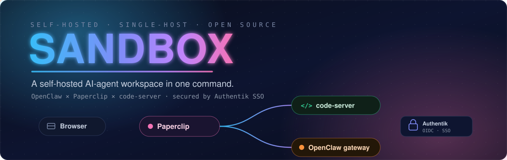

<!-- Banner -->
<p align="center">
  
</p>

<!-- Badges -->
<p align="center">
  <a href="https://github.com/WaromiV/sandbox/actions/workflows/build.yml">
    
  </a>
  <a href="#-license">
    
  </a>
  
  
  
</p>

<p align="center">
  
  
  
  
  <a href="https://github.com/WaromiV/sandbox/commits/main"></a>
  
</p>

<p align="center">
  <b>Sandbox</b> bundles three open-source projects into one self-hosted AI-agent workspace and brings them all up with a single command.<br/>
  <a href="#-quick-start"><b>Quick start</b></a> ·
  <a href="#-whats-inside"><b>What's inside</b></a> ·
  <a href="#-architecture"><b>Architecture</b></a> ·
  <a href="#-single-sign-on"><b>SSO</b></a> ·
  <a href="#-deploy-to-a-server"><b>Deploy</b></a> ·
  <a href="#-updating"><b>Update</b></a>
</p>

---

## ⚡ Quick start

**You need:** Linux/macOS · [Node](https://nodejs.org) ≥ 22.16 · [pnpm](https://pnpm.io) 11 (`corepack enable`) · [Docker](https://docs.docker.com/engine/) (only for the SSO layer) · `git`, `curl`, `openssl`.

```bash
# 1. Clone
git clone https://github.com/WaromiV/sandbox.git
cd sandbox

# 2. Build the two app services (code-server ships prebuilt)
( cd openclaw  && pnpm install && pnpm build )
( cd paperclip && pnpm install && pnpm build )

# 3. Bring up the whole cluster — gateway + UI + editor (+ Authentik SSO)
./bring-up.sh
```

`bring-up.sh` provisions Authentik, starts every service on loopback, and health-checks each URL:

| Service        | URL                              | Notes                                          |
| -------------- | -------------------------------- | ---------------------------------------------- |
| 📎 **Paperclip**   | <http://127.0.0.1:3110>          | Browser-facing UI · Authentik OIDC client · role authority |
| `</>` code-server  | <http://127.0.0.1:8090>          | **No built-in auth** (`--auth none`); gate with Authentik forward-auth |
| 🦞 OpenClaw        | <http://127.0.0.1:18789/healthz> | **No built-in auth** (`--auth none`); gate with Authentik forward-auth |
| 🔐 Authentik       | <http://127.0.0.1:9000>          | Identity provider (OIDC + forward-auth)        |

> **Dev has no reverse proxy.** openclaw + code-server run ungated on loopback. To gate them like production, front them with nginx + Authentik forward-auth — see [`AGENTS.md`](AGENTS.md) (“Auth model”) for a ready-to-paste config.

```bash
# Skip the SSO stack entirely (no Docker needed):
USE_AUTHENTIK=0 ./bring-up.sh

# Stop everything:
pkill -f 'openclaw|paperclip|code-server'
```

> **Logs** stream to `./logs/`. openclaw + code-server run with `--auth none`; the only gate is Authentik forward-auth at the reverse proxy (see [`AGENTS.md`](AGENTS.md)).

---

## 🧩 What's inside

Sandbox is the integration layer. The product is what these three pieces become *together*: an assistant that does the work, an orchestrator that runs the company, and an editor where it all happens.

| | Component | Role | Port |
|---|---|---|---|
| 🦞 | **[OpenClaw](openclaw/)** | Multi-channel AI gateway — *the employee*. Talks to you on the channels you already use and executes work. | `:18789` |
| 📎 | **[Paperclip](paperclip/)** | Node + React orchestration UI — *the company*. Org charts, budgets, goals, and agent coordination. Owns the user/role DB and is the **only browser-facing service**. | `:3110` |
| `</>` | **[code-server](code-server/)** | Patched VS Code in the browser — *the workbench*. Loopback, no built-in auth; gated by Authentik forward-auth at `/editor`. | `:8090` |
| 🔐 | **[Authentik](deploy/authentik/)** | Self-hosted OIDC identity provider — paperclip's OIDC login **and** the forward-auth gate for code-server + openclaw. | `:9000` |

> **If OpenClaw is an _employee_, Paperclip is the _company_** — and code-server is the desk they share.

---

## 🏗 Architecture

In production, one nginx vhost fronts the whole cluster and **Authentik is the single gate**. paperclip logs in via OIDC; code-server and openclaw have no auth of their own and are protected by an Authentik forward-auth subrequest (`auth_request`) on their paths.

```
                                ┌──────────────────────────┐
                                │   🔐 Authentik (OIDC IdP) │  :9000
                                │   • paperclip OIDC login   │
                                │   • forward-auth outpost   │
                                └────────────┬─────────────┘
                                   nginx auth_request │ + OIDC bounce
              ┌──────────────────────────────┼──────────────────────────────┐
              ▼                               ▼                              ▼
   ┌─────────────────────┐        ┌──────────────────────┐       ┌────────────────────┐
   │  🌐  Your browser   │ ─────▶ │  📎  Paperclip  :3110 │       │ </> code-server     │ :8090
   └─────────────────────┘  nginx │  • OIDC client        │       │   --auth none       │
              │              ▲     │  • role authority     │       │ (loopback; gated by │
              │              │     │  • user + role DB     │       │  forward-auth)      │
              └──────────────┘     └───────────┬───────────┘       └────────────────────┘
       /editor, /openclaw gated by             │ ws (no token)
       Authentik forward-auth                  ▼
                                   ┌──────────────────────┐
                                   │  🦞  OpenClaw  :18789 │  --auth none (loopback)
                                   └──────────────────────┘
```

**Roles:** `admin` and `user`. The first person to ever sign in becomes `admin` (race-safe singleton bootstrap); everyone else defaults to `user` and is promoted by an admin. Paperclip is the source of truth (`GET /api/access/role`). To restrict a forward-auth path (e.g. the editor) to admins, bind a group policy to the `openclaw-forward-auth` application in Authentik.

---

## 🔐 Single sign-on

Auth is centralized on [Authentik](https://goauthentik.io/) (MIT, self-hosted). There are exactly two kinds of integration:

- **paperclip is an OIDC client.** It runs Authentik's OIDC login, owns the user/role DB, and exposes `GET /api/access/role`. The provisioner writes its client config to `~/.openclaw/oidc/paperclip.json`.
- **code-server and openclaw have no auth of their own** (`--auth none`, loopback). A single Authentik **forward-auth** proxy provider (`openclaw-forward-auth`, assigned to the embedded outpost) guards them — the reverse proxy runs an `auth_request` against `/outpost.goauthentik.io/auth/nginx` on `/editor` and `/openclaw`.

This means there's **one place** to reason about who can reach the editor and the gateway: Authentik. Any signed-in user passes by default; bind a group policy to the `openclaw-forward-auth` application to lock a path down (e.g. editor = admins only).

> The reverse proxy is what enforces this. `bring-up.sh` runs the services on loopback but does **not** stand up nginx, so in dev they're ungated unless you add the proxy yourself — copy the config from [`AGENTS.md`](AGENTS.md). Production (`deploy/install-openclaw-cluster.sh`) wires nginx + forward-auth + TLS for you.

---

## 🚀 Deploy to a server

For a real host (not the dev `bring-up.sh`), `deploy/` ships systemd units and the SSO stack:

```bash
deploy/install-openclaw-cluster.sh     # installs the 3 systemd services
deploy/fetch-artifacts.sh              # pulls prebuilt service bundles
```

```
deploy/
├── systemd/                # openclaw.service · paperclip.service · code-server.service
├── authentik/              # docker-compose + provision.sh (creates OIDC apps)
└── install-openclaw-cluster.sh
```

There's also a self-contained **bridge installer** — `openclaw-bridge-installer.sh` — that points an *existing* systemd OpenClaw unit at a vendored build carrying the Paperclip bridge schema, via a drop-in override (fully reversible with `--rollback`):

```bash
sudo ./openclaw-bridge-installer.sh            # install
sudo ./openclaw-bridge-installer.sh --verify   # check
sudo ./openclaw-bridge-installer.sh --rollback # undo
```

---

## 🔄 Updating

Once the cluster is live you can pull the latest build straight from the **OpenClaw Control UI** — open **Settings**, find **"Update from OpenClaw UI"**, and click. It pulls the newest successful `build.yml` artifacts from this **public** repo (no token needed), deploys **only the components whose content hash changed**, atomically repoints the `current` symlink each systemd unit runs from, restarts just those units, and **rolls back automatically** if one fails its health check. `code-server` is republished byte-identical when untouched, so it's skipped — no needless editor restart.

The action is **admin-only** (`operator.admin`). Prefer a shell? [`deploy/fetch-artifacts.sh`](deploy/fetch-artifacts.sh) does the same pull → swap → restart from the command line.

### 🧩 If OpenClaw runs under systemd

The updater **discovers each unit's scope at runtime**, so it works whether your services are **system** units (`/etc/systemd/system`, run as root) or **user** units (`systemctl --user`, `~/.config/systemd/user/…` — the default for `openclaw onboard --install-daemon`).

| Your setup | What the click does |
| --- | --- |
| **System / root units** (the cluster default) | The gateway is already root, so it swaps + restarts directly. One click, done. |
| **User units / non-root gateway** | The gateway can't write a root-owned stack or restart system units on its own, so the panel shows a **password** field. Enter your login password and it escalates the privileged steps via `sudo` — validated up front, sent only over **HTTPS or loopback**, and **never logged or stored**. |

> The updater repoints a `…/<component>/current` symlink, so a unit qualifies only if its `WorkingDirectory` points at one (as the units in [`deploy/systemd/`](deploy/systemd/) do). A stock `openclaw onboard` user daemon whose `ExecStart` points at the global npm/`bin` path isn't symlink-versioned — keep using `openclaw update` for that gateway; the button still updates the other components.

### 📦 If you installed "as is" from the dist bundle

This is the layout [`deploy/install-openclaw-cluster.sh`](deploy/install-openclaw-cluster.sh) + [`deploy/fetch-artifacts.sh`](deploy/fetch-artifacts.sh) produce: each service lives under `/opt/openclaw-stack/<component>/releases/<run-id>/` with a `current` symlink, and the systemd units run from `…/current`. That's exactly what the button drives — every click drops a fresh `releases/<run-id>/`, flips `current`, and restarts only the changed unit:

```
/opt/openclaw-stack/
├── openclaw/      releases/<run-id>/  +  current ──▶ unit WorkingDirectory
├── paperclip/     releases/<run-id>/  +  current
└── code-server/   releases/<run-id>/  +  current
```

Old releases are kept, so rollback is just flipping the symlink back — which the updater does for you on a failed health check.

> The **first** click after a fresh install has no recorded baseline, so all three components are treated as changed (a full deploy). Every click after that is selective by content hash.

---

## 📂 Repository layout

```
sandbox/
├── bring-up.sh                  # one-command dev cluster (start here)
├── openclaw/                    # 🦞 multi-channel AI gateway
├── paperclip/                   # 📎 orchestration server + React UI (browser-facing)
├── code-server/                 # </> patched VS Code in the browser
├── deploy/                      # systemd units + Authentik SSO stack
├── tests/                       # cross-service tests (e2e)
├── assets/                      # README banner
└── logs/                        # runtime logs (gitignored)
```

---

## 📜 License

[MIT](openclaw/LICENSE) — each bundled project keeps its own license: **OpenClaw**, **Paperclip**, and **code-server** are all MIT.

<p align="center"><sub>Built to be self-hosted. Your host, your data, your agents.</sub></p>
